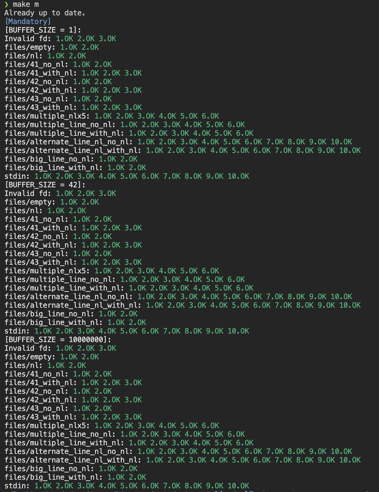
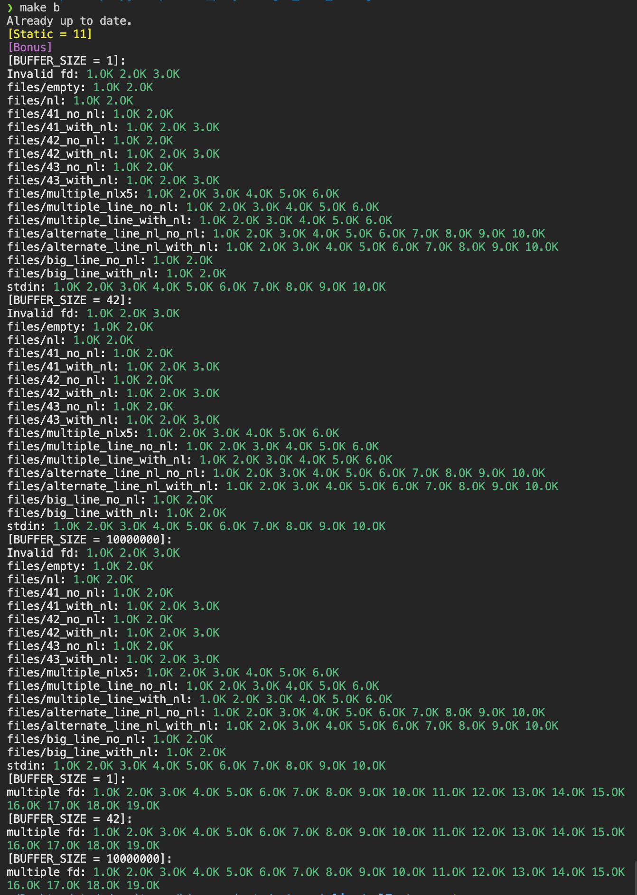
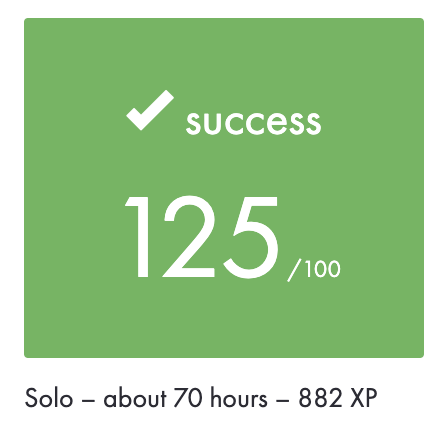

<h1 align="center">
	📚👨🏻‍💻<i>42_Cursus: </i>get_next_line
</h1>

<p align="center">
	
	
	
</p>
<p align="center">
	<a href="../README.md">English &nbsp;&nbsp;</a>
	<a href="./README_CN.md"> 简体中文 &nbsp;&nbsp; </a>
</p><hr>

## 💡 项目介绍
这是42 network 的一个项目，位于New curriculum第二个circle。这是非常重要的一个基础项目，同时也是Exam Rank03的题目。

get_next_line() 函数实现逐行读取文件。大致实现思路为：使用一定大小的缓冲区读取文件，然后将数据连接到一个临时字符串(``gettempstr` & `ft_joint``)，一直到读取到'\n'或EOF为止。将临时字符串中包含'\n'及之前的字符串返回作为行字符串line(`ft_line()`)，将'\n'后的剩余字符串保存至静态字符串staticstr(`ft_staticstr()`)，以供下一次调用。

项目主题: [get_next_line_subject_en.pdf ](../en.subject.pdf)
## 🧰 使用方法
根据subject要求，使用cc和带有-Werror -Wextra -Wall的flag编译，同时程序需要能handle不同大小的BUFFER_SIZE。
```SHELL
git clone https://github.com/srall123/get_next_line.git
cc -Werror -Wextra -Wall -D BUFFER_SIZE=<size> get_next_line.c get_next_line_utils.c main.c && ./a.out
```

## ⚒️ 错误处理
如果发生以下任何情况，则 get_next_line() 函数将返回 NULL：

- 打开文件时发生错误；
- 读取文件时发生错误；
- 内存分配失败；

## 🔍 注意事项
- 仓库代码并没有考虑Norm；
- 便于理解和记录，源文件中插入了大量中英文注释；

## 🛡️ Tester
项目使用了如下测试，感谢作者:
[Tripouille/gnlTester](https://github.com/Tripouille/gnlTester) `git clone https://github.com/Tripouille/gnlTester.git`
<b>测试结果</b>


## ✔︎Moulinette

